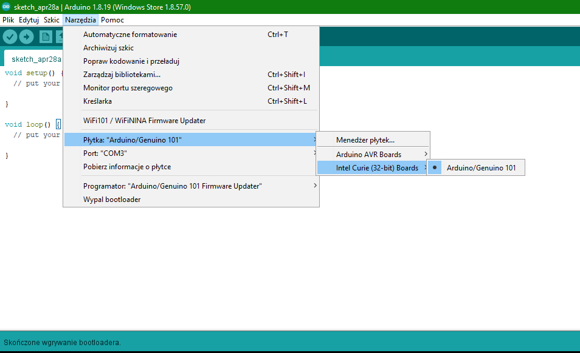

### UWAGA!

### Nie odpowiadam za szkody wyrządzone wgraniem nieodpowiedniego bootloadera.

## Wgrywasz na własną odpowiedzialność!

Do wgrania oprograwania będzie potrzebny program [Arduino](https://www.arduino.cc/en/software).

Postępuj zgodnie z instrukcją.

## Instalacja sterowników płytki

Sterowniki płytki są niezbędne w procesie instalacji nowego bootloadera płytki. Każda płytka może być inna. Przed przystąpieniem do instalacji, sprawdź dokładnie, jaki model płytki posiadasz!

W celu instalacji wejdź w:

`Narzędzia > Płytka > Menadżer płytek...`

Wybierz firmę płytki, wpisz model i zainstaluj odpowiedni sterownik. W moim przypadku to Arduino 101.

Zamknij okno i wybierz odpowiednią płytkę z listy.

Wybierz port szeregowy, do którego jest podłączona płytka.

Wybierz programator płytki.

Wypal bootloader.

